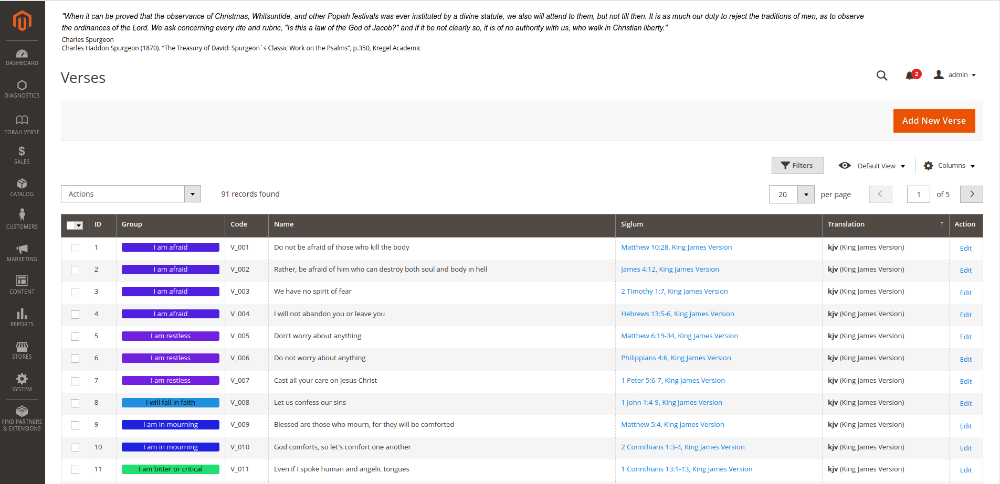

# TorahVerse-M2

Magento2 module providing Torah verses/quotes sliders both for backend (by default) and for frontend.

# Description

Backend part (**_Admin Panel Slider_**) is only for magento2 users/supporters but not for customers.
Frontend part is available for magento2 customers in two modes. First Mode (**_Homepage Slider_**) is available
only on Homepage in 5 placements:
* **_'top.container'_** - After page header top
* **_'content.top'_** - Main content top
* **_'content.bottom'_** - Main content bottom
* **_'page.bottom'_** - Before page footer
* **_'footer'_** - Page footer',
* **_'footer-container'_** - Page Footer Container

There is another mode available (**_Custom Sliders_**): 

You may place wherever you want, and as many as you wish.
To configure your slider just add it here to the list (name it by **_'code'_** that use only letters (a-z or A-Z), numbers (0-9) or underscore (_) and the first character should be a letter.)

# How to install
in [packagist](https://packagist.org/packages/jaroslawzielinski/torahverse-m2)
```shell
cd YourProject
composer require jaroslawzielinski/torahverse-m2
```

# Backend

## First steps

### Log in to Admin panel


You can see the slider at the top of the screen.

### Enable Menu


Save and clear cache


See the Torah Verse menu on the left bar.

## Slider Configuration

### Enable
Enable module / Disable module and disable menu.

### Menu enabled
Enables/disables menu in the left bar (and access to the grids)

### Sweep time
Time value in milliseconds between slides (horizontal swipe)

### Is vertical sweep possible
Enables feature for vertical scroll (it is triggered when text exceeds _**'Number of shown rows'**_)

### Vertical Sweep time
Time value in milliseconds between changing current shown row (during vertical scroll)

### Is group colours enable
Enables box with group title and group colour

### Html Template for Verse Slider Frame
Provides html template for user tweaks. Available keys are listed in comment.
* **_{url}_** - link for bible.info.pl service (target is "_blank")
* **_{textColour}_** - colour for verse text
* **_{colour}_** - colour for group border/group label background
* **_{groupName}_** - name of a group
* **_{antiColour}_** - contrast colour to group border/group label background
* **_{content}_** - verse content
* **_{description}_** - verse description

### Html Template for Quote Slider Frame
Provides html template for user tweaks. Available keys are listed in comment.
* **_{textColour}_** - colour for quote text
* **_{colour}_** - colour for group border/group label background
* **_{groupName}_** - name of a group
* **_{antiColour}_** - contrast colour to group border/group label background
* **_{content}_** - quote content
* **_{author}_** - quote author
* **_{description}_** - quote description

### Verses ordered
Enables numbering for verses or plain text mode.

### Text Colour
Colour for text of sliders

### Background Hover Colour
Background colour when slider is being hovered/paused

### Mode of slider
Three modes for sliders are available:
* **_'randomautoplayinf'_** - Randomized Auto play infinity loop
* **_'autoplayinf'_** - Ordered Auto play infinity loop
* **_'random'_** - Random view - static

### Number of shown rows
Number of shown rows (when 3 - default, please clear _**'Custom Styles'**_)

### Custom Styles
Provides custom css styles (enables user tweaks (colour change, background, remove cursor etc.))

## See the available grids

### Groups


### Groups/Verses


### Groups/Quotes


