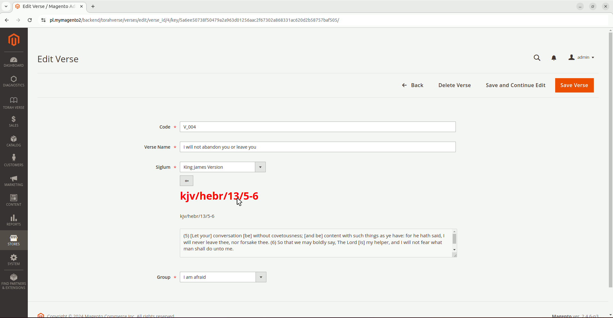
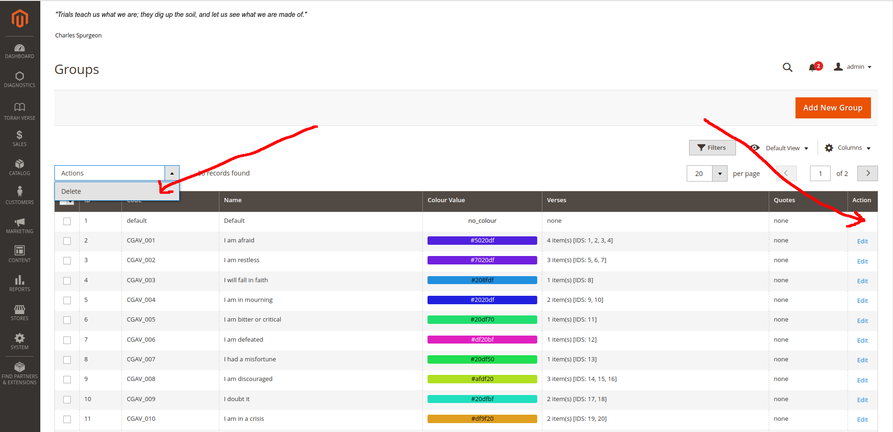
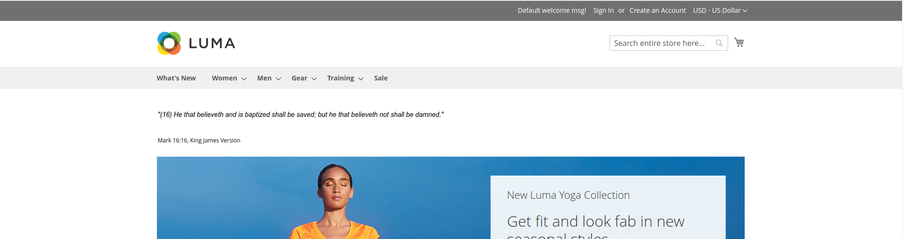

# TorahVerse-M2

A Magento2 module that provides dynamic Torah verse/quote sliders for both the backend (by default) and the frontend. 
Whether you're a store admin or a customer, you can enjoy these engaging, responsive sliders.

The module calculates the available space and adjusts the number of words per line to optimize the display. If the text 
exceeds the configured row limit, the verse scrolls vertically, creating a seamless user experience. This ensures that 
the widget is **R**esponsive **W**eb **D**esigned and works beautifully on all devices.

One of the most exciting aspects of this module is that it leverages the 
[Torah](https://github.com/JaroslawZielinski/Torah) library, a powerful API client with built-in caching (via SQLite). 
This PHP library pulls text from the [Bible Info](https://biblia.info.pl/) service, offering up to 21 different 
translations. For more details, feel free to check out the [repository](https://github.com/JaroslawZielinski/Torah).

If you're excited about this project and want to support its ongoing development, consider buying me a coffee! Your 
support means a lot and helps keep this project alive.

[](https://www.buymeacoffee.com/jaroslawzielinski)

# New Features:

## Torah Input (frontend/backend)
This UI component allows you to select any Bible verse from any translation, with a preview available in both the 
frontend and backend. Simply click the verse to navigate to the full passage on the Bible service.

### Frontend
Choose any Bible verse you like:


### Backend
Easily edit the Bible verse reference directly in the form (just click _back_ button):



## Torah Search

Note: Before using the search feature, you need to index your preferred Bible translations by running the following command:
console command for f.e **bt**:
```
bin/magento torah:cache:flush bt && bin/magento torah:cache:warm bt
```

### Searching options
* **Search**: Enter the text you're looking for.
* **Search in results**: Narrow down results with additional conditions.
* **Search parts**: Filter by specific sections of the Torah (e.g., Tanakh, Nevi'im ketuvim, Brit Hadasha or Old Testamet, New Testament)
* **Case-sensitive search**: Enable or disable case sensitivity.
* **Verse context**: Choose to display surrounding verses for context.
* **Translation**: Select one of 21 available translations.


## Torah Annuals Group
This feature allows you to display a specific quote on a given day of the year—perfect for creating a daily inspiration
widget! You can set up 366 quotes, one for each day of the year.

To create an annual quote:
* Create a quote and fill in the required fields.
* Assign it to an annual group.
* Name (field _'Code'_) the quote using a special code that includes the date (last 4 characters represent the month and day, e.g.,
  _'quote1024'_ for October 24th).

# Installation Guide
You can find the module on [Packagist](https://packagist.org/packages/jaroslawzielinski/torahverse-m2). To install:
```shell
cd YourProject
composer require jaroslawzielinski/torahverse-m2
```
# Uninstallation
To uninstall the module and revert all database changes, run the following command:

```ssh
bin/magento torahverse:module:uninstall
```

# Text Slider Features
## Backend Sliders
The backend slider is visible only to Magento 2 users and supporters—customers won’t see this.

## Frontend Sliders

For the frontend, you can choose between two slider types:
1. **Homepage Slider**: Display the slider on the homepage in 5 different placements:

   * After the header: `top.container`
   * At the top of the content: `content.top`
   * At the bottom of the content: `content.bottom`
   * Before the footer: `page.bottom`
   * Inside the footer: `footer`, `footer-container`


2. **Custom Sliders**: These can be placed anywhere on your site. Just create a slider and add it to any page, block, or 
widget using the Admin Panel.

After defining custom slider with code f.e. 'annual_quotes' (see [Slider Configurations](#slider-configurations)) you 
can use it within CMS Block/CMS Page:


or create a CMS Widget:


## Slider Modes
### Randomized Auto-Play Infinite Loop
Displays verses in a random order, continuously looping.
### Ordered Auto-Play Infinite Loop
Displays verses in the order they appear in the admin panel.
### Random Static View
Displays one random verse per page load.

## More Features
### Pause Mode
Hover over the slider to pause the animation.
### Group Colors
Display group names and colors for easy organization.

# Backend Features
## First steps
### 1. Log in to the Admin Panel.


### 2. Enable the module from the configuration menu.


## 3. Add quotes and verses to different groups.
### Groups

Possible operations: **Add New Group**, **Delete**, **Edit**

_Notice_: You can not modify/delete **Default Group**.

### Groups/Verses

Possible operations: **Add New Verse**, **Delete**, **Group Assign**, **Edit**

### Groups/Quotes

Possible operations: **Add New Quote**, **Delete**, **Group Assign**, **Edit**

### 4. Configure your sliders for the frontend and backend.

# Configuration - Torah Verse

The module offers extensive customization options, from verse text colors to slide timing. Easily tweak your sliders to 
match your site’s style and layout.

## General Settings
### Enable
Enable module / Disable module and disable menu.
### Menu enabled
Enables/disables menu in the left bar (and access to the grids)
### Service Link Enable
This option allows to link to bible service on click (default is **on**)
### Sweep time
Time value in milliseconds between slides (horizontal swipe)
### Is vertical sweep possible
Enables feature for vertical scroll (it is triggered when text exceeds _**'Number of shown rows'**_)
### Vertical Sweep time
Time value in milliseconds between changing current shown row (during vertical scroll)
### Is group colours enable
Enables box with group title and group colour
### Html Template for Verse Slider Frame
Provides html template for user tweaks. Available keys are listed in comment.
* **_{url}_** - link for bible.info.pl service (target is "_blank")
* **_{textColour}_** - colour for verse text
* **_{colour}_** - colour for group border/group label background
* **_{groupName}_** - name of a group
* **_{antiColour}_** - contrast colour to group border/group label background
* **_{content}_** - verse content
* **_{description}_** - verse description
### Html Template for Quote Slider Frame
Provides html template for user tweaks. Available keys are listed in comment.
* **_{textColour}_** - colour for quote text
* **_{colour}_** - colour for group border/group label background
* **_{groupName}_** - name of a group
* **_{antiColour}_** - contrast colour to group border/group label background
* **_{content}_** - quote content
* **_{author}_** - quote author
* **_{description}_** - quote description
### Html Template for Annual Slider Frame
Provides html template for user tweaks. Available keys are listed in comment.
* **_{textColour}_** - colour for quote text
* **_{colour}_** - colour for group border/group label background
* **_{groupName}_** - name of a group
* **_{antiColour}_** - contrast colour to group border/group label background
* **_{name}_** - quote name
* **_{content}_** - quote content
* **_{author}_** - quote author
* **_{description}_** - quote description
* **_{description2}_** - quote description2
* **_{description3}_** - quote description3

### Verses ordered
Enables numbering for verses or plain text mode.
### Text Colour
Colour for text of sliders
### Background Hover Colour
Background colour when slider is being hovered/paused
### Mode of slider
Three modes for sliders are available:
* **_'randomautoplayinf'_** - Randomized Auto play infinity loop
* **_'autoplayinf'_** - Ordered Auto play infinity loop
* **_'random'_** - Random view - static
### Number of shown rows
Number of shown rows (when 3 - default, please clear _**'Custom Styles'**_)
### Custom Styles
Provides custom css styles (enables user tweaks (colour change, background, remove cursor etc.))
## Admin Panel Slider
### Enable
enables/disables the feature.
### Override configuration
You may override following settings (from **General Settings**):
* **Sweep time**
* **Is vertical sweep possible**
* **Vertical Sweep time**
* **Is group colours enable**
* **Verses ordered**
* **Text Colour**
* **Mode of slider**
### Slider Configuration
In this multi select you may choose groups that you would like to display.
## Homepage Slider
### Enable
enables/disables the feature.
### Override configuration
You may override following settings (from **General Settings**):
* **Sweep time**
* **Is vertical sweep possible**
* **Vertical Sweep time**
* **Is group colours enable**
* **Verses ordered**
* **Text Colour**
* **Mode of slider**
###  Placement of a slider
There are 5 available placements (**Magento2** container name in layout):
* **_'top.container'_** - After page header top
* **_'content.top'_** - Main content top
* **_'content.bottom'_** - Main content bottom
* **_'page.bottom'_** - Before page footer
* **_'footer'_** - Page footer',
* **_'footer-container'_** - Page Footer Container
### Slider Configuration
In this multi select you may choose groups that you would like to display.
## Custom Sliders
### Enable
enables/disables the feature.
### Override configuration
You may override following settings (from **General Settings**):
* **Sweep time**
* **Is vertical sweep possible**
* **Vertical Sweep time**
* **Is group colours enable**
* **Verses ordered**
* **Text Colour**
* **Mode of slider**
### Slider Configurations
Array for sliders (code, slider configuration). You may add/edit/delete as many configurations as
you want.

# Configuration - Torah
## Language Settings
### Language
You have two available languages: English and Polish. This settings changes the language of description in Torah siglum.
### Translate Preset
You may also update Groups/Verses/Quotes Presets in given language version. Remember to Save before clicking the button
unless you prefer the language written in button's label.

## Torah Input
### Division
You may choose division of books in Torah Input (e.g. **Old Testament\New Testament**). Default value is 
**Tanakh/Nevi'im ketuvim/Brithadasha**. This feature will be used in the future.
### Bible Tools enabled
Default value is **No**. If set to **Yes** it appears in menu in **Bible Tools** group as **Verse Config** where 
**Verse Pick** and **Verse Search** are presented. In the future the input will be customized (you will choose all the options by just clicking it,
  without typing anything). The Torah input is also used in Admin Panel in Verse Grid (_Add New Verse/Edit_ action)


after clicking, it will be opened in new tab (notice little square put next to the link) as a front page:


### Case Sensitive
Default Option for **V**erse **S**earch form.
### Division parts filter
Default Option for **V**erse **S**earch form.
### Results per page
Default Option for **V**erse **S**earch form.
## Library Settings
### Cache Enable
This option enables/disable API caching for Bible Service. Down bellow there are serveral indicators for Bible 
Translations Cache state. 

**100%** means the cache is warmed and all of the bible verses are stored in local DB (sqllite). **V**erse **S**earch 
will be possible for cached Translation.

**0%** means the cache is not ready. You can not use the **V**erse **S**earch for the translation then.


# Frontend
## Example uses

## Pause mode (cursor changes, and background)

_Notice_: You can configure it in  **Background Hover Colour**, **Custom Styles** configuration options.
## Group Colours enabled

# See also
* [Groups/Verses/Quotes Presets (EN)](GROUPS_en.md)
* [Groups/Verses/Quotes Presets (PL)](GROUPS_pl.md)
* [Torah github](https://github.com/JaroslawZielinski/Torah)
# Inspiration for vertical scroll
* [Truthunedited](https://www.youtube.com/@Truthunedited) - presenting Torah verses


Explore these features, play with the settings, and see how this module can elevate your **Magento2** site! And if you find 
value in this, I'd greatly appreciate your support on **Buy Me a Coffee**—it helps keep projects like this alive.


[](https://www.buymeacoffee.com/jaroslawzielinski)
