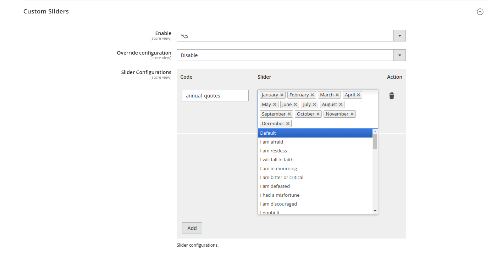

# TorahVerse-M2
Magento2 module providing Torah verses/quotes text sliders both for backend (by default) and for frontend.

The length of available space is measured during slider display. Next the number of words for row division is 
calculated. The first shown rows are presented. If the number of rows exceeds threshold set in configuration, 
the verse is being scrolled vertically.

Thanks to above the widget is **R**esponsive **W**eb **D**esigned and can be shown on various types of devices.

# How to install
in [packagist](https://packagist.org/packages/jaroslawzielinski/torahverse-m2)
```shell
cd YourProject
composer require jaroslawzielinski/torahverse-m2
```
# Text Slider Features
## Types
Backend part (**_Admin Panel Slider_**) is only for magento2 users/supporters but not for customers.

Frontend part is available for magento2 customers in two types. First Type (**_Homepage Slider_**) is available
only on Homepage in 5 placements (**Magento2** container name in layout):
* **_'top.container'_** - After page header top
* **_'content.top'_** - Main content top
* **_'content.bottom'_** - Main content bottom
* **_'page.bottom'_** - Before page footer
* **_'footer'_** - Page footer',
* **_'footer-container'_** - Page Footer Container

There is another frontend type available (**_Custom Sliders_**):
You may place wherever you want, and as many as you wish.
To configure your slider just add it here to the list (name it by **_'code'_** that use only letters (a-z or A-Z),
numbers (0-9) or underscore (_) and the first character should be a letter.)

You can insert the slider whatever place you want in Your Shop in Admin Panel 
**[Main Menu -> CONTENT -> Elements -> Pages/Blocks/Widgets]** as 
**_Torah Verse Custom Slider_** widget (just add code there - f.e. _tv_slider_01_, and configure the slider in 
TorahVerse Configuration part -> **Custom Sliders**).
## Modes
### Randomized Auto play infinity loop (by default)
In this mode items positions are random in item array and they are presented one by one in infinite loop. You can pause
an element just by moving mouse cursor over it (the cursor will change to ).
### Ordered Auto play infinity loop
In this mode items positions in item array are the same as in the admin panel grid. Verses go first, the quotes go after
from given group. The rest is similar to mode above.
### Random view - static
Only one random verse/quote is displayed per page view. When verse/quote has vertical scroll feature enabled it is
scrolled only once. If you would like it to be scrolled again you must hover mouse on it in pause mode and wait. It will
be scrolled as many times as it will be in pause mode.
# Backend
## First steps
### Log in to Admin panel

You can see the slider at the top of the screen.
### Enable Menu

Save and clear cache

See the Torah Verse menu on the left bar.
## See the available grids
### Groups

Possible operations: **Add New Group**, **Delete**, **Edit**

_Notice_: You can not modify/delete **Default Group**.

### Groups/Verses

Possible operations: **Add New Verse**, **Delete**, **Group Assign**, **Edit**

### Groups/Quotes

Possible operations: **Add New Quote**, **Delete**, **Group Assign**, **Edit**

# Configuration
## General Settings
### Enable
Enable module / Disable module and disable menu.
### Menu enabled
Enables/disables menu in the left bar (and access to the grids)
### Sweep time
Time value in milliseconds between slides (horizontal swipe)
### Is vertical sweep possible
Enables feature for vertical scroll (it is triggered when text exceeds _**'Number of shown rows'**_)
### Vertical Sweep time
Time value in milliseconds between changing current shown row (during vertical scroll)
### Is group colours enable
Enables box with group title and group colour
### Html Template for Verse Slider Frame
Provides html template for user tweaks. Available keys are listed in comment.
* **_{url}_** - link for bible.info.pl service (target is "_blank")
* **_{textColour}_** - colour for verse text
* **_{colour}_** - colour for group border/group label background
* **_{groupName}_** - name of a group
* **_{antiColour}_** - contrast colour to group border/group label background
* **_{content}_** - verse content
* **_{description}_** - verse description
### Html Template for Quote Slider Frame
Provides html template for user tweaks. Available keys are listed in comment.
* **_{textColour}_** - colour for quote text
* **_{colour}_** - colour for group border/group label background
* **_{groupName}_** - name of a group
* **_{antiColour}_** - contrast colour to group border/group label background
* **_{content}_** - quote content
* **_{author}_** - quote author
* **_{description}_** - quote description
### Verses ordered
Enables numbering for verses or plain text mode.
### Text Colour
Colour for text of sliders
### Background Hover Colour
Background colour when slider is being hovered/paused
### Mode of slider
Three modes for sliders are available:
* **_'randomautoplayinf'_** - Randomized Auto play infinity loop
* **_'autoplayinf'_** - Ordered Auto play infinity loop
* **_'random'_** - Random view - static
### Number of shown rows
Number of shown rows (when 3 - default, please clear _**'Custom Styles'**_)
### Custom Styles
Provides custom css styles (enables user tweaks (colour change, background, remove cursor etc.))
## Admin Panel Slider
### Enable
enables/disables the feature.
### Override configuration
You may override following settings (from **General Settings**):
* **Sweep time**
* **Is vertical sweep possible**
* **Vertical Sweep time**
* **Is group colours enable**
* **Verses ordered**
* **Text Colour**
* **Mode of slider**
### Slider Configuration
In this multi select you may choose groups that you would like to display.
## Homepage Slider
### Enable
enables/disables the feature.
### Override configuration
You may override following settings (from **General Settings**):
* **Sweep time**
* **Is vertical sweep possible**
* **Vertical Sweep time**
* **Is group colours enable**
* **Verses ordered**
* **Text Colour**
* **Mode of slider**
###  Placement of a slider
There are 5 available placements (**Magento2** container name in layout):
* **_'top.container'_** - After page header top
* **_'content.top'_** - Main content top
* **_'content.bottom'_** - Main content bottom
* **_'page.bottom'_** - Before page footer
* **_'footer'_** - Page footer',
* **_'footer-container'_** - Page Footer Container
### Slider Configuration
In this multi select you may choose groups that you would like to display.
## Custom Sliders
### Enable
enables/disables the feature.
### Override configuration
You may override following settings (from **General Settings**):
* **Sweep time**
* **Is vertical sweep possible**
* **Vertical Sweep time**
* **Is group colours enable**
* **Verses ordered**
* **Text Colour**
* **Mode of slider**
### Slider Configurations
Array for sliders (code, slider configuration). You may add/edit/delete as many configurations as
you want.

## Language Settings
### Language
You have two available languages: English and Polish. This settings changes the language of description in Torah siglum.
### Translate Preset
You may also update Groups/Verses/Quotes Presets in given language version. Remember to Save before clicking the button
unless you prefer the language written in button's label.

# Frontend
## Example uses

## Pause mode (cursor changes, and background)

_Notice_: You can configure it in  **Background Hover Colour**, **Custom Styles** configuration options.
## Group Colours enabled

# See also
* [Groups/Verses/Quotes Presets (EN)](GROUPS_en.md)
* [Groups/Verses/Quotes Presets (PL)](GROUPS_pl.md)
* [Torah github](https://github.com/JaroslawZielinski/Torah)
# Inspiration for vertical scroll
* [Truthunedited](https://www.youtube.com/@Truthunedited) - presenting Torah verses
